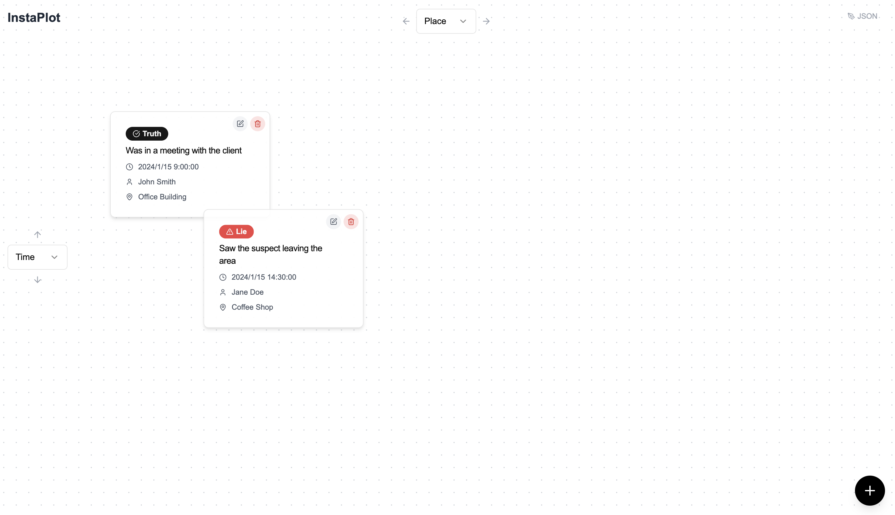
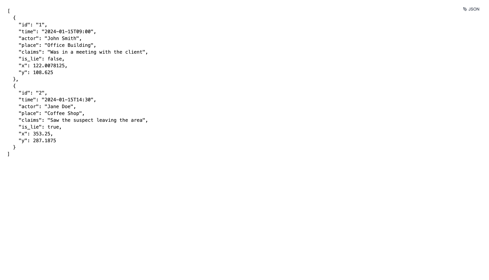

# InstaPlot

A professional visual case management tool for organizing and analyzing case information cards in an interactive workspace. Perfect for investigators, researchers, and analysts who need to visualize relationships between events, people, and locations.

🌐 **[Live Demo](https://insta-plot.vercel.app)**



### JSON Editor Mode


## ✨ Features

### 🎯 Interactive Workspace
- **Full-Screen Plot Area**: Maximizes available space with a professional dotted grid background
- **Drag & Drop Interface**: Smooth card movement with Framer Motion animations
- **Real-time Organization**: Cards automatically reorganize when switching axis modes
- **Clean Minimalist Design**: Distraction-free workspace with floating controls

### 🎛️ Dynamic Axis Configuration
- **X-Axis Control**: Place, Actor, or Time (positioned at top center with directional arrows)
- **Y-Axis Control**: Place, Actor, or Time (positioned at left center with directional arrows)
- **Instant Reorganization**: Cards automatically arrange when axis modes change
- **Visual Feedback**: Clear directional indicators for each axis

### 💾 Data Management
- **Auto-Save**: All cards automatically saved to browser localStorage
- **JSON Editor**: Live JSON editing with real-time preview and validation
- **Session Persistence**: Data survives page refreshes and browser restarts
- **Default Sample Data**: Starts with example cards to demonstrate functionality
- **Flexible Import**: Supports JSON import with automatic field validation

### 🃏 Smart Case Cards
- **Comprehensive Data**: Time, Actor, Place, Claims, and Truth/Lie classification
- **Visual Indicators**: Color-coded badges for truth (✓) vs lie (⚠) status
- **Inline Editing**: Click edit button to modify cards directly on the plot
- **Dual Edit Modes**: Both inline editing and modal editing available
- **Professional Design**: Semi-transparent cards with shadows and hover effects
- **Quick Actions**: Edit and delete buttons appear on each card

### 🎨 Modern UI/UX
- **Floating Controls**: Minimalist floating action button for adding new cards
- **JSON Toggle**: Quick access to JSON editor mode for bulk operations
- **Responsive Design**: Works across different screen sizes
- **Professional Aesthetics**: Clean design with subtle animations and transitions
- **Intuitive Navigation**: Logical control placement and visual hierarchy

## 🚀 Getting Started

### Prerequisites
- Node.js (v18 or higher)
- npm, yarn, or pnpm

### Installation

```bash
# Clone the repository
git clone <repository-url>
cd instaPlot

# Install dependencies
npm install

# Start the development server
npm run dev
```

Open [http://localhost:3000](http://localhost:3000) to view the application.

### Production Build

```bash
# Build for production
npm run build

# Start production server
npm start
```

## 🔄 Axis Combinations

### Timeline Analysis
- **X: Time, Y: Place** - Track events across locations over time
- **X: Time, Y: Actor** - Follow individual actors chronologically
- **X: Actor, Y: Time** - Compare timelines between different people

### Relationship Analysis
- **X: Place, Y: Actor** - See which actors were present at each location
- **X: Actor, Y: Place** - View location patterns for each person
- **X: Place, Y: Time** - Analyze location usage over time

## 🛠️ Technical Stack

- **Framework**: Next.js 15.2.4 with App Router
- **Language**: TypeScript for type safety
- **Styling**: Tailwind CSS with custom safelist configuration
- **UI Components**: Radix UI primitives with shadcn/ui components
- **Animation**: Framer Motion for smooth drag-and-drop interactions
- **Icons**: Lucide React for consistent iconography
- **State Management**: React hooks with localStorage persistence
- **Forms**: React Hook Form with Zod validation
- **Theming**: next-themes for theme management

## 📁 Project Structure

```
instaPlot/
├── app/
│   ├── layout.tsx             # Root layout with theme provider
│   ├── page.tsx               # Main page component
│   └── globals.css            # Global styles and CSS variables
├── components/
│   ├── plot-builder.tsx       # Core application component
│   ├── theme-provider.tsx     # Theme context provider
│   └── ui/                    # shadcn/ui components
├── hooks/
│   ├── use-mobile.tsx         # Mobile detection hook
│   └── use-toast.ts           # Toast notification hook
├── lib/
│   └── utils.ts               # Utility functions
├── styles/
│   └── globals.css            # Additional global styles
├── public/
│   └── screenshot.png         # App screenshot
├── sample-cards.json          # Example card data
├── components.json            # shadcn/ui configuration
├── tailwind.config.ts         # Tailwind configuration
├── postcss.config.mjs         # PostCSS configuration
├── next.config.mjs            # Next.js configuration
└── package.json               # Dependencies and scripts
```

## 🔧 Configuration

### Tailwind Safelist
The project includes a comprehensive safelist in `tailwind.config.ts` to prevent CSS purging during production builds:

- Layout classes (positioning, sizing, display)
- Color and background utilities
- Typography and spacing
- Animation and transition classes
- Interactive states (hover, focus)

### Data Format
Cards are stored in localStorage as JSON with the following structure:

```typescript
interface CaseCard {
  id: string;
  time: string;        // ISO datetime string
  actor: string;       // Person involved
  place: string;       // Location
  claims: string;      // Description/claims
  is_lie: boolean;     // Truth/lie classification
  x: number;          // X position on plot
  y: number;          // Y position on plot
}
```

## 🎯 Use Cases

- **Criminal Investigation**: Timeline analysis and witness statement verification
- **Research**: Academic research data organization and analysis
- **Journalism**: Fact-checking and source verification
- **Legal**: Case building and evidence organization
- **Business**: Project timeline and stakeholder analysis

## 🔜 Roadmap

- [ ] SSO login integration (Google, GitHub, Microsoft)
- [ ] Cloud data storage and synchronization
- [ ] Multiple plot management (save/load different sets of cards)
- [ ] Export functionality (PDF, PNG, CSV)
- [ ] Advanced filtering and search within cards
- [ ] Undo/redo functionality for card operations
- [ ] Card templates and presets
- [ ] Bulk card operations via JSON editor
- [ ] Keyboard shortcuts for common actions
- [ ] Print-friendly layouts

## 🤝 Contributing

1. Fork the repository
2. Create a feature branch (`git checkout -b feature/amazing-feature`)
3. Commit your changes (`git commit -m 'Add amazing feature'`)
4. Push to the branch (`git push origin feature/amazing-feature`)
5. Open a Pull Request

## 📄 License

This project is licensed under the MIT License - see the LICENSE file for details.

## 🆘 Support

For issues, questions, or feature requests, please open an issue on GitHub.

---

**Built with ❤️ using Next.js, TypeScript, and Tailwind CSS**